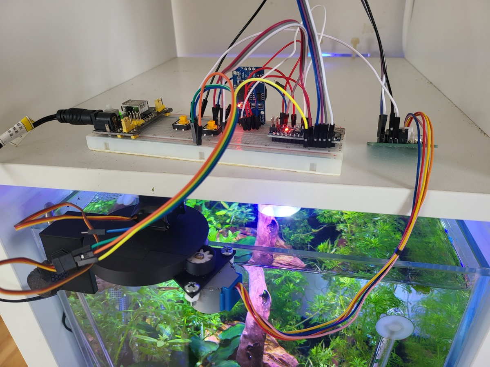
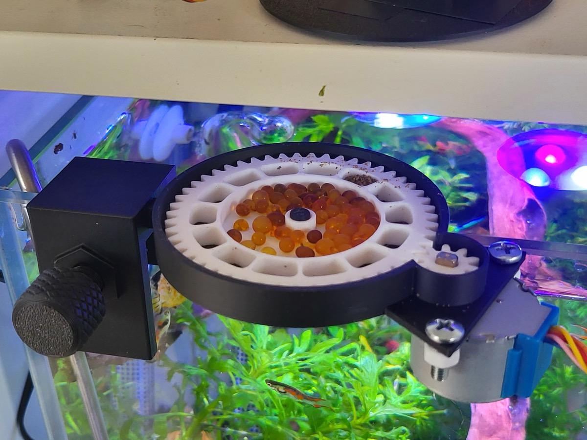
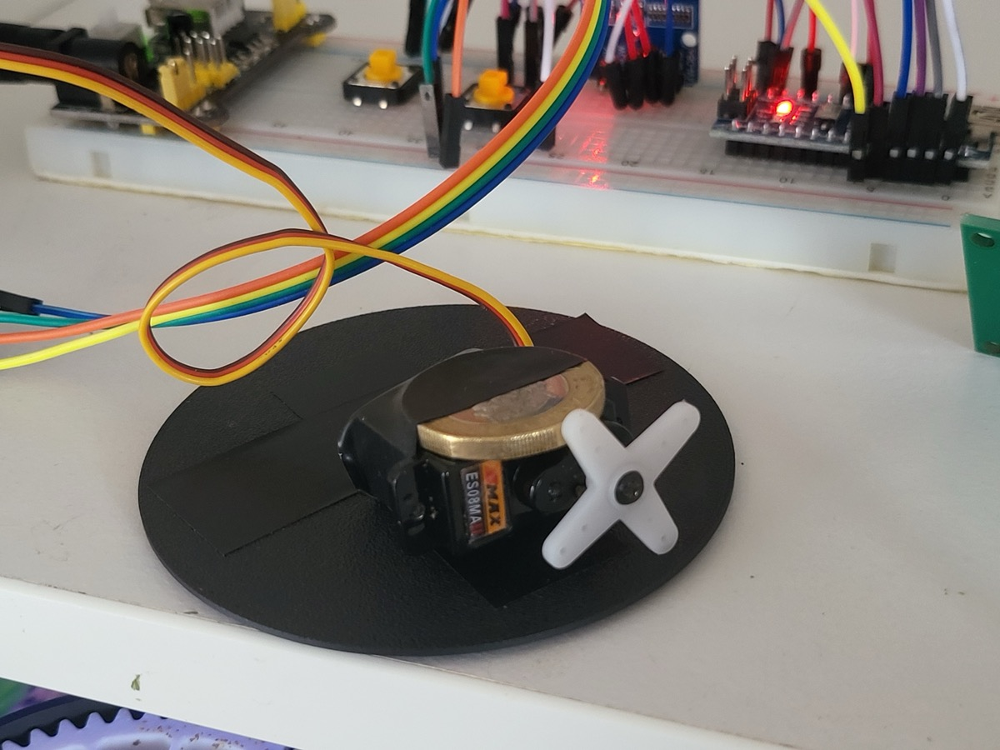

# Arduino Fish Feeder v2

An automatic fish feeder designed for small, precise dosages. Built around an Arduino Nano with a stepper motor driving a 14-well rotating dispenser and a servo motor to tap food through.

## Photos

<p float="left">
  
  
  
</p>

## 3D Model


The enclosure and dispenser wheel are designed in Bambu Lab's 3MF format. The model file is `models.3mf`.

## Purpose

Most commercial fish feeders dispense food in large, imprecise quantities and only support basic daily scheduling. This feeder is designed for:

- **Precise, small dosages** — a 14-well rotating dispenser controls exactly how much food is released per feeding
- **Flexible scheduling** — feedings can be configured to specific dates and times, not just a daily interval

## Hardware

| Component | Purpose |
|-----------|---------|
| Arduino Nano | Microcontroller |
| 28BYJ-48 stepper motor + ULN2003 driver board | Rotates the food dispenser wheel |
| Servo motor | Taps the dispenser to ensure food drops through |
| DS3231 RTC module (AT24C32 IIC) | Keeps accurate time for scheduling |
| 12V DC transformer + 12V to 5V converter board | Powers the system |
| 3D printed parts | Enclosure, gear system, and dispenser wheel |

### Wiring

| Pin | Connection |
|-----|-----------|
| D6 | Servo signal |
| D7 | Test button (active low, internal pull-up) |
| D8–D11 | ULN2003 stepper driver |
| A4 | RTC SDA |
| A5 | RTC SCL |

## Technical Challenges Solved

### Low stepper motor torque
The 28BYJ-48 produces very little torque on its own. A **gear reduction system** (3D printed) multiplies the torque enough to reliably rotate the food dispenser.

### Food sticking in wells
Food particles can stick inside the wells and fail to fall through. A **servo motor taps the dispenser** for 60 seconds after each rotation, shaking food loose.

### Precise portioning
The dispenser wheel has **14 wells**. Each feeding advances the wheel by exactly 1/14th of a revolution (730 steps of the stepper motor), releasing one pre-measured portion. The wheel also includes a dedicated space for a **moisture desiccant** to keep the food dry and prevent clumping.

## Software

### Libraries required

- `Stepper.h` (Arduino built-in)
- `Servo.h` (Arduino built-in)
- `RTClib` by Adafruit

### How to compile and flash

1. Install [Arduino IDE](https://www.arduino.cc/en/software)
2. Install the **RTClib** library via the Arduino Library Manager (`Sketch > Include Library > Manage Libraries`, search for `RTClib` by Adafruit)
3. Open `arduino_fish_feeder_v2.ino` in Arduino IDE
4. Select **Arduino Nano** as the board and the correct COM/serial port
5. Click **Upload**

### Configuring the schedule

Feeding times are hard-coded in the `schedules` array near the top of the `Scheduler` class:

```cpp
int schedules[20][6] = { // [year, month, day, hour, minute, second]
    {2026, 3, 22, 0, 10, 0},
    // add more entries here
};
```

Up to 20 entries are supported. The firmware automatically selects the next upcoming scheduled time.

### Setting the RTC clock

With the device connected via USB, open the Arduino IDE Serial Monitor (9600 baud) and send:

- `u` — enter interactive prompts to set the current date and time
- `t` — print the current time read from the RTC

### Manual test feeding

Press the button on **D7** to trigger an immediate feeding cycle (debounced to 500 ms).

## Future Improvements

- More flexible scheduling (recurring daily/weekly rules rather than specific timestamps)
- Wireless control — adjust schedule and trigger feeding remotely over Wi-Fi or Bluetooth
